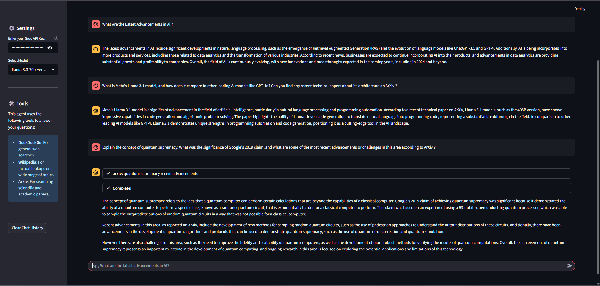
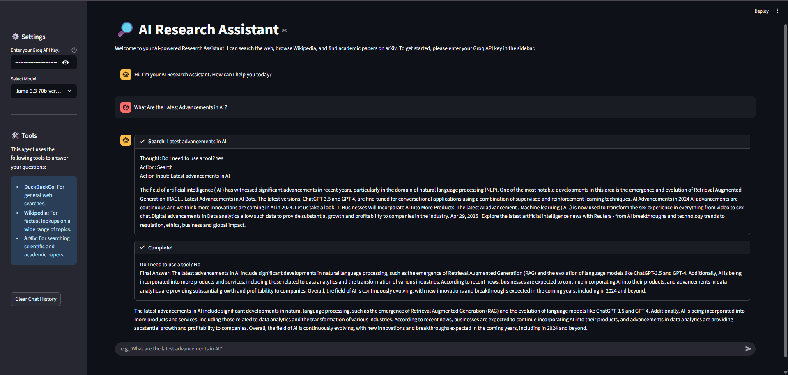
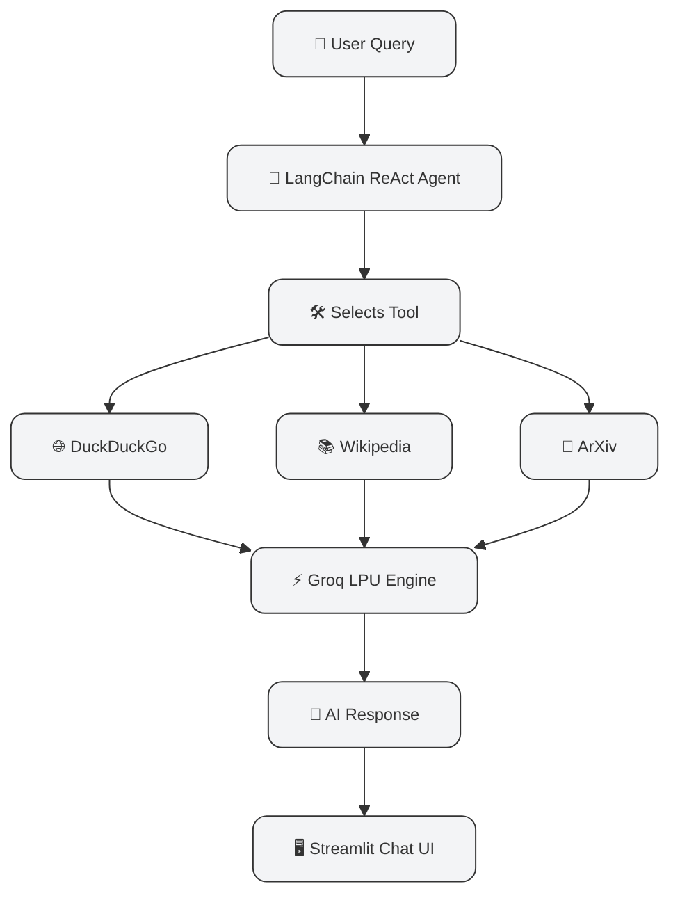

---

# 🔍 AI Research Assistant With Search Engine

<p align="center">
  
  
  
  
  
  
</p>  

A **blazingly-fast AI Research Assistant** built with **LangChain Agents** and **Groq’s LPU Engine**.
This tool can **search the web**, **explore Wikipedia**, and **fetch academic papers from ArXiv** to deliver **research-grade answers in real-time**.

💡 Designed for **students, researchers, and developers** who need an instant research sidekick.

---

## 🌈 Screenshots

<p align="center">
  
</p>  

<p align="center">
  
</p>  

---

## ✨ Features

* 🖥️ **Interactive Chat Interface** – Modern Streamlit UI
* 🧠 **Autonomous ReAct Agent** – Thinks, reasons, and acts
* 🛠️ **Multi-Tool Power** – DuckDuckGo, Wikipedia, ArXiv
* ⚡ **Insanely Fast** – Powered by Groq’s LPU inference engine
* 📜 **Memory Support** – Keeps conversation context
* 🔄 **Switch Models Live** – Llama 3.1, Mixtral & more
* 🚀 **Agent Trace Mode** – Watch reasoning in real-time

---

## 🛠 Tech Stack

* **Framework:** Streamlit
* **Orchestration:** LangChain Agents
* **LLM Provider:** Groq LPU Engine
* **Tools:** DuckDuckGo Search, Wikipedia, ArXiv
* **Language:** Python

---

## ⚡ Prerequisites

* Python 3.8+
* A **Groq API Key** (get free from [GroqCloud](https://groq.com/))

---

## 🚀 Getting Started

### 1️⃣ Clone the Repository

```bash
git clone https://github.com/kanhaiya-98/GenAI-Lab.git
cd "GenAI-Lab/AI RESEARCH ASSISTANT WITH SEARCH ENGINE"
```

### 2️⃣ Create Virtual Environment

**Windows:**

```bash
python -m venv venv
venv\Scripts\activate
```

**macOS/Linux:**

```bash
python3 -m venv venv
source venv/bin/activate
```

### 3️⃣ Install Requirements

```bash
pip install -r requirements.txt
```

### 4️⃣ Set Up Environment

Create a `.env` file and add:

```bash
GROQ_API_KEY="your_groq_api_key_here"
```

---

## ▶️ Run the App

```bash
streamlit run app.py
```

Access at 👉 [http://localhost:8501](http://localhost:8501)

---

## ⚙️ How It Works



---
