# 🤖 Local LLM Q\&A Chatbot

<p align="center">
  
  
  
  
  
  
</p>

A **lightning-fast, fully local Q\&A chatbot** built with **Streamlit** and **Ollama**, allowing you to interact with open-source LLMs like **Llama 3**, **Phi-3**, and **Mistral** without internet or paid APIs.

💡 Perfect for research, coding help, or just testing LLMs locally with full privacy.

---

## ✨ Features

* 🖥️ **Interactive Chat Interface** – Smooth and modern UI for conversations
* 📜 **Session Chat History** – Keep track of dialogue across sessions
* 🏠 **Local LLM Support** – Run Llama 3, Phi-3, Mistral entirely offline
* 🔄 **Model Switching** – Toggle between installed models via dropdown
* ⚙️ **Parameter Tuning** – Control temperature & response length
* 🔒 **Private & Secure** – No data leaves your machine
* 🚀 **Modern Tools** – Streamlit frontend + LangChain orchestration

---

## 🛠 Tech Stack

* **Framework:** Streamlit
* **LLM Orchestration:** LangChain
* **LLM Hosting:** Ollama
* **Language:** Python

---

## ⚡ Prerequisites

* Python 3.8+
* [Ollama](https://ollama.com/)
* An Ollama-compatible model (e.g., Llama 3, Phi-3, Mistral)

Pull Llama 3 after installing Ollama:

```bash
ollama pull llama3
```

---

## 🚀 Getting Started

### 1️⃣ Clone the Repository

```bash
git clone https://github.com/your-username/your-repo-name.git
cd your-repo-name
```

### 2️⃣ Create a Virtual Environment

**Windows:**

```bash
python -m venv venv
venv\Scripts\activate
```

**macOS/Linux:**

```bash
python3 -m venv venv
source venv/bin/activate
```

### 3️⃣ Install Dependencies

```bash
pip install -r requirements.txt
```

### 4️⃣ Set Up Environment Variables (Optional)

Enable **LangSmith** for LLM tracking:

```bash
LANGCHAIN_API_KEY="your_langsmith_api_key_here"
LANGCHAIN_TRACING_V2="true"
```

> ⚠️ Optional: Chatbot works perfectly without LangSmith.

---

## ▶️ Running the Application

```bash
streamlit run app.py
```

Access it locally at: [http://localhost:8501](http://localhost:8501)

💬 Chat, experiment, and explore **your local LLM** in action!

---

## ⚙️ How It Works

```mermaid
flowchart TD
    A["📂 Upload PDFs / Input Text"] --> B["🔎 Chunking & Embedding"]
    B --> C["🗄️ Store in Vector DB (ChromaDB)"]
    C --> D["📜 Query Reformulation / Context-Aware"]
    D --> E["🔍 Similarity Search in Vector DB"]
    E --> F["⚡ Groq LLM / Ollama LLM Processing"]
    F --> G["🤖 Generate Answer / Response"]
    G --> H["💬 Display Answer in Chat UI"]

    classDef step fill:#f3f4f6,stroke:#333,stroke-width:1px,rx:10,ry:10,font-size:12px;
    class A,B,C,D,E,F,G,H step;
```



> This workflow shows **input → embedding → retrieval → LLM → output**, giving users an intuitive overview at a glance.

---

## 🌈 Screenshots

<p align="center">
  
  
</p>

---

## 💎 Pro Tips

* Experiment with **different models** to see varied creativity
* Use **temperature** and **max tokens** to fine-tune responses
* Keep your **models updated locally** for best performance

---


🔎 AI Research Assistant with LangChain & Groq
<div align="center">
<h1 id="main-title"></h1>
</div>

<script>
const title = "AI Research Assistant";
let i = 0;
function typeWriter() {
if (i < title.length) {
document.getElementById("main-title").innerHTML += title.charAt(i);
i++;
setTimeout(typeWriter, 150);
} else {
document.getElementById("main-title").innerHTML += " 🚀";
}
}
window.onload = typeWriter;
</script>

<p align="center">


</p>

A blazingly-fast AI Research Assistant that leverages the power of LangChain Agents and Groq's LPU Inference Engine. This tool can browse the web, search Wikipedia, and find academic papers on ArXiv to answer complex questions in real-time.

💡 Perfect for students, researchers, and developers who need a powerful research tool with an interactive, user-friendly interface.

✨ Features
🖥️ Interactive Chat Interface – Modern and responsive UI built with Streamlit.

🧠 Autonomous Agent – Uses a ReAct agent to reason and decide which tool to use.

🛠️ Multi-Tool Capability – Seamlessly uses DuckDuckGo, Wikipedia, and ArXiv.

⚡ Insanely Fast Responses – Powered by the Groq LPU Inference Engine.

📜 Conversation Memory – Remembers the context of the conversation.

🔄 Real-Time Model Switching – Change the underlying LLM (Llama 3.1, Mixtral) on the fly.

🚀 Live Thought Process – See the agent's reasoning as it works to find the answer.

🛠 Tech Stack
Framework: Streamlit

LLM Orchestration: LangChain

LLM API Provider: Groq

Tools: DuckDuckGo Search, Wikipedia, ArXiv

Language: Python

⚡ Prerequisites
Python 3.8+

A Groq API Key, which you can get for free from GroqCloud.

🚀 Getting Started
1️⃣ Clone the Repository
git clone [https://github.com/your-username/your-repo-name.git](https://github.com/your-username/your-repo-name.git)
cd your-repo-name

2️⃣ Create a Virtual Environment
Windows:

python -m venv venv
venv\Scripts\activate

macOS/Linux:

python3 -m venv venv
source venv/bin/activate

3️⃣ Install Dependencies
pip install -r requirements.txt

▶️ Running the Application
Run the Streamlit app from your terminal:

streamlit run app.py

Open your browser and navigate to http://localhost:8501.

Enter your Groq API key in the sidebar, and start chatting!

⚙️ How It Works
This application uses a LangChain ReAct Agent. The agent reasons about how to answer a user's prompt, chooses an appropriate tool, gets the result, and repeats the process until it has enough information to provide a final answer.

graph TD
    A[👨‍💻 User Enters Prompt in UI] --> B{🤖 LangChain Agent};
    B --> C{"Thought: I need information to answer.<br/>Action: Choose a tool"};
    C --> D[🛠️ Select Tool <br/>(Search, Wikipedia, or ArXiv)];
    D --> E[🔎 Execute Tool & Get Results];
    E --> F{"Observation: Pass results back to Agent"};
    F --> B;
    B --> G{"Thought: I have enough information.<br/>Action: Formulate Final Answer"};
    G --> H[🧠 Groq LLM Generates Response];
    H --> I[💬 Display Answer in Chat UI];

    classDef user fill:#e0f2fe,stroke:#0ea5e9,stroke-width:2px;
    classDef agent fill:#fefce8,stroke:#eab308,stroke-width:2px;
    classDef tool fill:#f0fdf4,stroke:#22c55e,stroke-width:2px;
    classDef llm fill:#fce7f3,stroke:#ec4899,stroke-width:2px;
    classDef ui fill:#f1f5f9,stroke:#64748b,stroke-width:2px;

    class A user;
    class B,C,F,G agent;
    class D,E tool;
    class H llm;
    class I ui;

This workflow shows the Reason-Act Loop: the agent thinks, acts by using a tool, observes the result, and repeats until the task is complete.

🌈 Screenshots
Replace these with your own screenshots after running the app!

<p align="center">


</p>

💎 Pro Tips
Ask Complex Questions: Try prompts that require information from multiple sources to see the agent's full potential.

Experiment with Models: Switch between Llama 3.1 and Mixtral in the settings to see how the responses and reasoning change.

Expand the Agent: This project is a great foundation. Try adding more tools (e.g., a calculator, weather API) to expand its capabilities!


