# 🤖 Local LLM Q\&A Chatbot

<p align="center">
  
  
  
  
  
  
</p>

A **lightning-fast, fully local Q\&A chatbot** built with **Streamlit** and **Ollama**, allowing you to interact with open-source LLMs like **Llama 3**, **Phi-3**, and **Mistral** without internet or paid APIs.

💡 Perfect for research, coding help, or just testing LLMs locally with full privacy.

---

## ✨ Features

* 🖥️ **Interactive Chat Interface** – Smooth and modern UI for conversations
* 📜 **Session Chat History** – Keep track of dialogue across sessions
* 🏠 **Local LLM Support** – Run Llama 3, Phi-3, Mistral entirely offline
* 🔄 **Model Switching** – Toggle between installed models via dropdown
* ⚙️ **Parameter Tuning** – Control temperature & response length
* 🔒 **Private & Secure** – No data leaves your machine
* 🚀 **Modern Tools** – Streamlit frontend + LangChain orchestration

---

## 🛠 Tech Stack

* **Framework:** Streamlit
* **LLM Orchestration:** LangChain
* **LLM Hosting:** Ollama
* **Language:** Python

---

## ⚡ Prerequisites

* Python 3.8+
* [Ollama](https://ollama.com/)
* An Ollama-compatible model (e.g., Llama 3, Phi-3, Mistral)

Pull Llama 3 after installing Ollama:

```bash
ollama pull llama3
```

---

## 🚀 Getting Started

### 1️⃣ Clone the Repository

```bash
git clone https://github.com/your-username/your-repo-name.git
cd your-repo-name
```

### 2️⃣ Create a Virtual Environment

**Windows:**

```bash
python -m venv venv
venv\Scripts\activate
```

**macOS/Linux:**

```bash
python3 -m venv venv
source venv/bin/activate
```

### 3️⃣ Install Dependencies

```bash
pip install -r requirements.txt
```

### 4️⃣ Set Up Environment Variables (Optional)

Enable **LangSmith** for LLM tracking:

```bash
LANGCHAIN_API_KEY="your_langsmith_api_key_here"
LANGCHAIN_TRACING_V2="true"
```

> ⚠️ Optional: Chatbot works perfectly without LangSmith.

---

## ▶️ Running the Application

```bash
streamlit run app.py
```

Access it locally at: [http://localhost:8501](http://localhost:8501)

💬 Chat, experiment, and explore **your local LLM** in action!

---

## ⚙️ How It Works

```mermaid
flowchart TD
    A["📂 Upload PDFs / Input Text"] --> B["🔎 Chunking & Embedding"]
    B --> C["🗄️ Store in Vector DB (ChromaDB)"]
    C --> D["📜 Query Reformulation / Context-Aware"]
    D --> E["🔍 Similarity Search in Vector DB"]
    E --> F["⚡ Groq LLM / Ollama LLM Processing"]
    F --> G["🤖 Generate Answer / Response"]
    G --> H["💬 Display Answer in Chat UI"]

    classDef step fill:#f3f4f6,stroke:#333,stroke-width:1px,rx:10,ry:10,font-size:12px;
    class A,B,C,D,E,F,G,H step;
```



> This workflow shows **input → embedding → retrieval → LLM → output**, giving users an intuitive overview at a glance.

---

## 🌈 Screenshots

<p align="center">
  
  
</p>

---

## 💎 Pro Tips

* Experiment with **different models** to see varied creativity
* Use **temperature** and **max tokens** to fine-tune responses
* Keep your **models updated locally** for best performance

---


