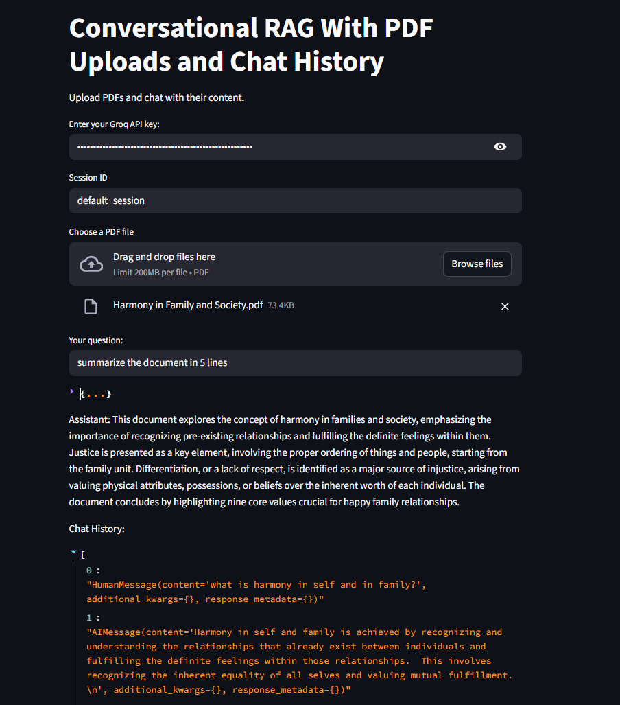
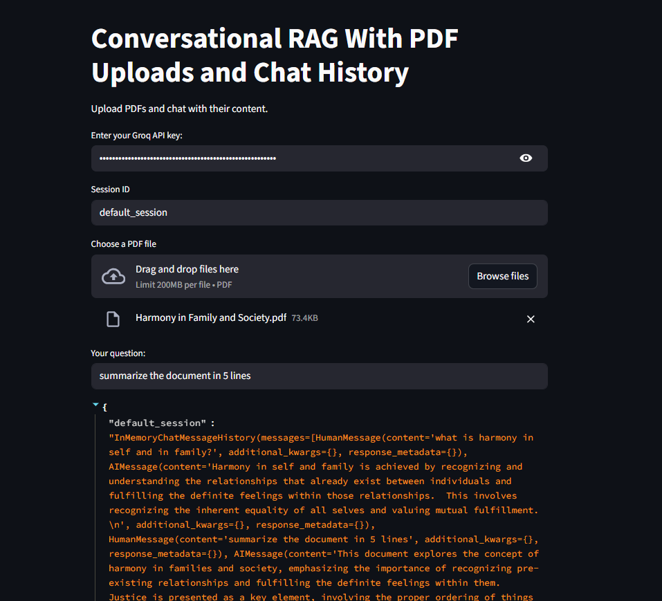

# 🤖 Conversational RAG Q&A with PDF Uploads & Chat History  

<p align="center">
  
  
  
  
  
  
</p>  

<p align="center">
  
  
</p>  

---

## 🚀 What is this?

An **AI-powered Research Assistant** that allows you to:  

✨ Upload **PDFs** 📑  
✨ Ask **conversational questions** 💬  
✨ Receive **context-aware answers** ⚡  
✨ Keep **chat history** persistent 🔄  

✅ Built on **Streamlit + LangChain + Groq + HuggingFace + ChromaDB**  

<p align="center">
  
  
</p>

---

## ✨ Features  

✅ **PDF Upload** – Single or multiple files  
✅ **Conversational Chat** – Natural dialogue with your docs  
✅ **Persistent Memory** – Session-based chat history  
✅ **RAG Pipeline** – Retrieval before generation for accuracy  
✅ **Groq LLM** – Lightning-fast inference  
✅ **Secure Keys** – `.env` for Hugging Face & Groq  

<p align="center">
  
  
  
  
  
</p>  

---

## ⚙️ How It Works  

```mermaid
flowchart TD
    A[📂 PDF Upload] --> B[🔎 Chunking & Embedding]
    B --> C[🗄️ Vector Store - ChromaDB]
    C --> D[📜 Query Reformulation - History Aware]
    D --> E[🔍 Similarity Search]
    E --> F[⚡ Groq LLM (Gemma-9b-it)]
    F --> G[🤖 Answer Generated]
